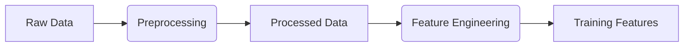
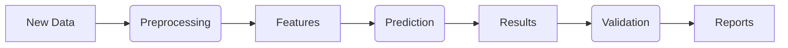

Here's a comprehensive `README.md` template for your Kedro Student Dropout Prediction project. Create this file in your project root directory:

```markdown
# Student Dropout Prediction Pipeline


A machine learning pipeline for predicting student dropout risk using Kedro.

## 📌 Table of Contents
- [Project Overview](#-project-overview)
- [Features](#-features)
- [Project Structure](#-project-structure)
- [Setup](#-setup)
- [Usage](#-usage)
- [Pipeline Architecture](#-pipeline-architecture)
- [Data Requirements](#-data-requirements)
- [Visualization](#-visualization)
- [Testing](#-testing)
- [Deployment](#-deployment)
- [Contributing](#-contributing)

## 🌟 Project Overview

This project predicts student dropout risk using:
- Historical academic performance
- Attendance records
- Demographic factors

**Key Components:**
1. Data processing pipeline
2. Model training workflow
3. Prediction service
4. Explainability features
5. Automated reporting

## 🚀 Features

### Core Functionality
- Data preprocessing and feature engineering
- Multiple model comparison (XGBoost, Random Forest, etc.)
- Hyperparameter tuning
- Model evaluation metrics

### Advanced Features
- SHAP value explanations
- Prediction validation
- Automated visualization
- Scheduled reporting

## 🏗️ Project Structure

```bash
kedro-student-dropout-prediction/
├── data/
│   ├── 01_raw/               # Input data
│   ├── 02_intermediate/      # Processed data
│   ├── 06_models/            # Trained models
│   └── 08_reporting/         # Reports and visualizations
├── conf/                     # Configuration
├── notebooks/                # Exploration notebooks
└── src/
    └── student_dropout_prediction/
        ├── pipelines/        # Data/ML pipelines
        ├── hooks.py          # Custom hooks
        └── settings.py       # Project settings
```

## 🛠️ Setup

### Prerequisites
- Python 3.8+
- [Poetry](https://python-poetry.org/) (recommended) or pip

### Installation
1. Clone the repository:
   ```bash
   git clone https://github.com/your-username/kedro-student-dropout-prediction.git
   cd kedro-student-dropout-prediction
   ```

2. Set up environment:
   ```bash
   # With Poetry
   poetry install

   # With pip
   python -m venv venv
   source venv/bin/activate  # Linux/Mac
   venv\Scripts\activate     # Windows
   pip install -r src/requirements.txt
   ```

3. Configure data:
   - Place your input data in `data/01_raw/`
   - Update `conf/base/catalog.yml` with your file paths

## 🏃 Usage

### Running the Pipeline
```bash
# Full pipeline
kedro run

# Specific pipeline
kedro run --pipeline prediction

# With visualization
kedro run --pipeline prediction --hooks src.student_dropout_prediction.hooks.VisualizationHooks
```

### Common Commands
| Command | Description |
|---------|-------------|
| `kedro run` | Run full pipeline |
| `kedro viz` | Launch interactive visualization |
| `kedro test` | Run unit tests |
| `kedro jupyter notebook` | Launch Jupyter notebook |

## 🏗️ Pipeline Architecture

### Data Processing Pipeline


### Prediction Pipeline


## 📊 Data Requirements

### Input Data Schema
```csv
student_id,term_id,english_score,maths_score,attendance_rate,...
```

### Expected Columns:
- **Required**: `student_id`, `english_score`, `maths_score`
- **Optional**: `attendance_rate`, `household_income`, `bullying_reported`

## 📈 Visualization

Access pipeline visualizations:
1. **Interactive**: Run `kedro viz` after pipeline execution
2. **Static Reports**: Find in `data/08_reporting/`
   - SHAP plots
   - Prediction distributions
   - Model metrics

## 🧪 Testing

Run tests with:
```bash
kedro test
```

Test coverage includes:
- Data validation
- Model training
- Prediction logic

## 🚀 Deployment

### Production Setup
1. Containerize with Docker:
   ```dockerfile
   FROM python:3.8-slim
   COPY . /app
   WORKDIR /app
   RUN pip install -r src/requirements.txt
   CMD ["kedro", "run"]
   ```

2. Schedule runs with Airflow/Luigi

### Monitoring
- MLflow for experiment tracking
- Prometheus for pipeline metrics

## 🤝 Contributing

1. Fork the project
2. Create your feature branch (`git checkout -b feature/AmazingFeature`)
3. Commit your changes (`git commit -m 'Add some AmazingFeature'`)
4. Push to the branch (`git push origin feature/AmazingFeature`)
5. Open a Pull Request

## 📜 License
Distributed under the MIT License. See `LICENSE` for more information.

## 📧 Contact
Project Maintainer - [Samson Banannkhu Mhango](mailto:sambanankhumhango@gmail..com)
```